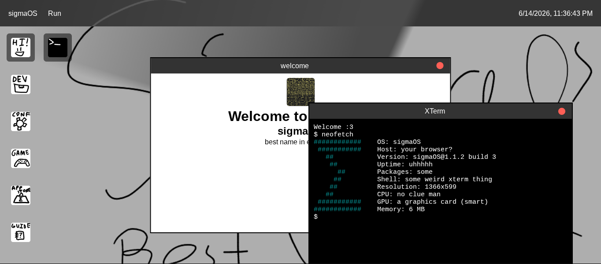

# sigmaOS
## A webOS for the Stardance WebOS1 mission

### Try
## **[Demo](https://datadecay.github.io/stardance-webos)**

### Main Features

- **Windows:** Very cool movable windows! Not resizable yet (coming soon!)
- **Packaged Apps:** Most apps (all but welcome and app installer) are bundled into zipfiles to make the entire thing modular!
- **App Store** Not just installable apps, but an app store, contains a grand total of 1 app
- **Customizable:** You can change the primary color, secondary color, and wallpaper and the entire color scheme adjusts! More options coming soon.

### Apps
 - Preinstalled
   - **Hi!**: what it sounds like
   - **Dev**: badly named app installer
   - **Guide**: learn
   - **Game**: a weird slot machine like game that I had on my hard drive that I made god knows how long ago
   - **Conf**: configuration?
   - **XTerm**: terminal!
   - **App Store:**: what it sounds like
 - App Store
   - **Read :3**: Not much of a book

### TODO
What I want to do with the webOS2 (most alr completed)
 - backend
 - support for hackclub oauth
 - roaming accounts
 - window resiszing and maximizing
 - more!
